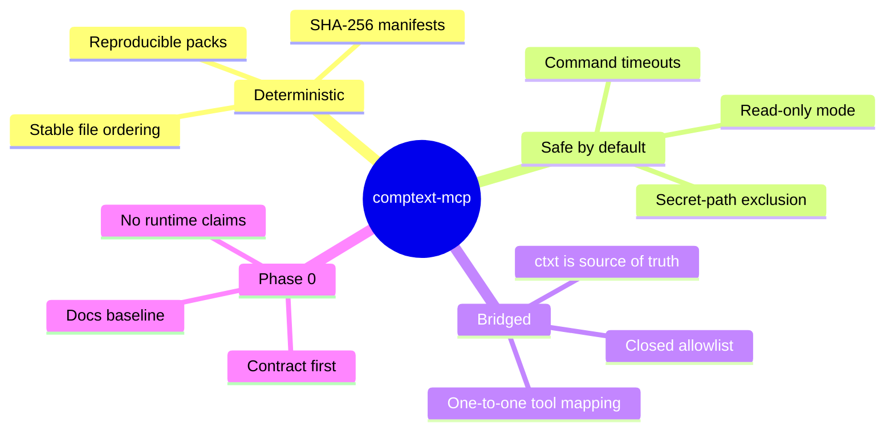
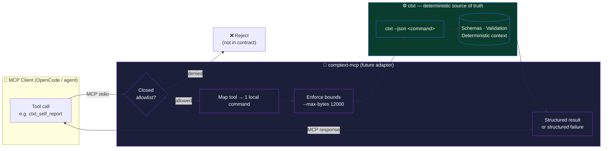
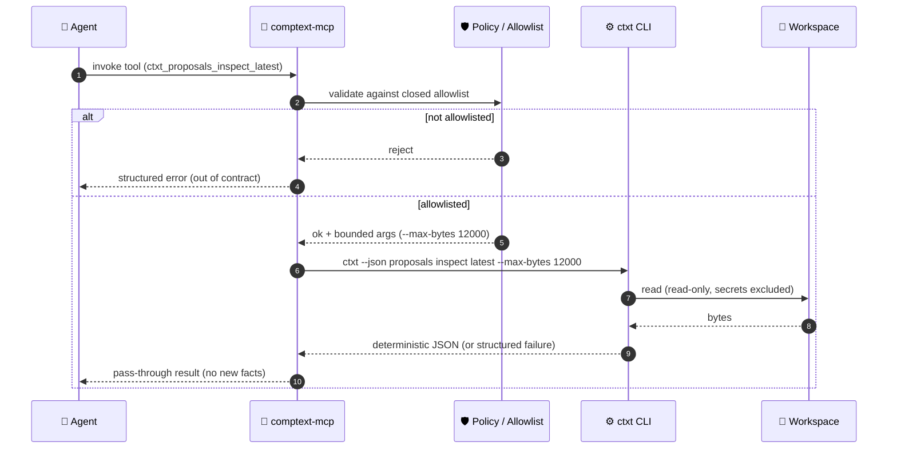
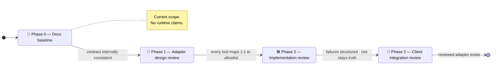
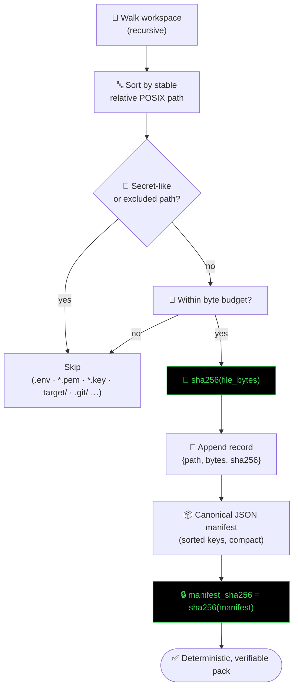
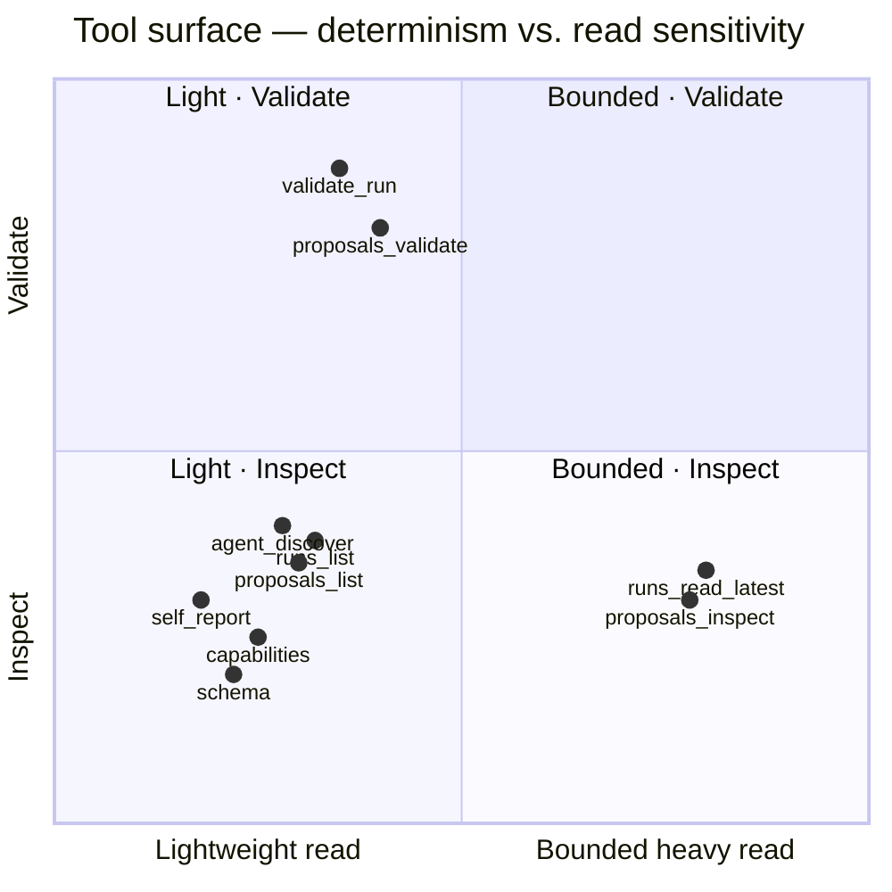
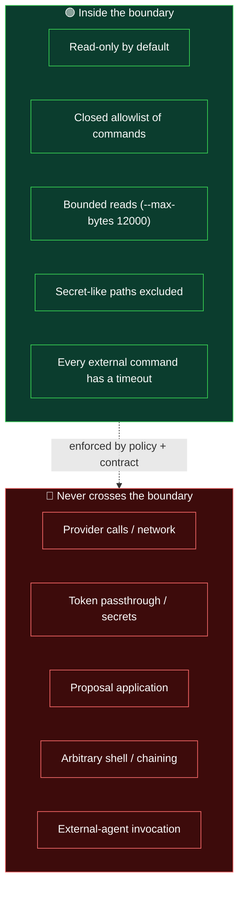
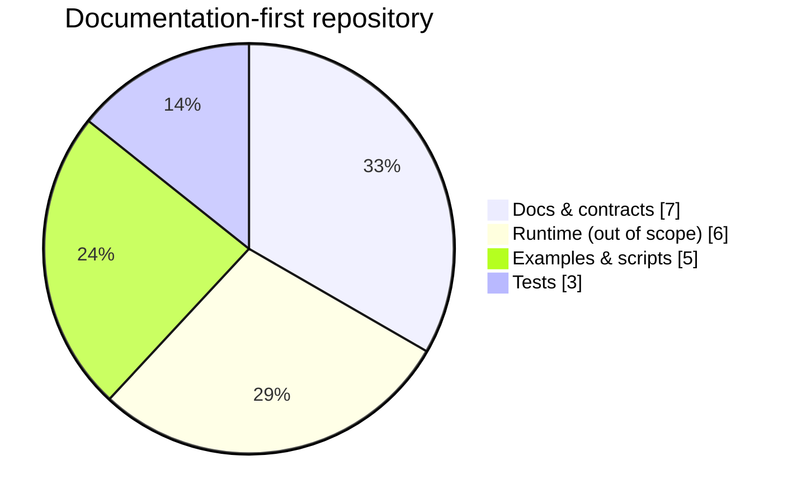
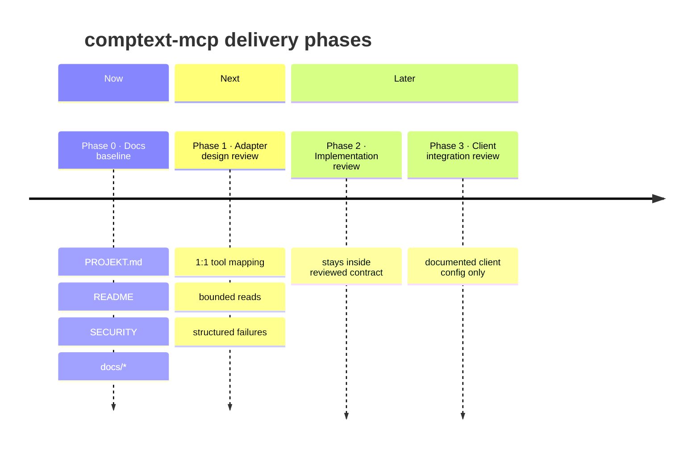
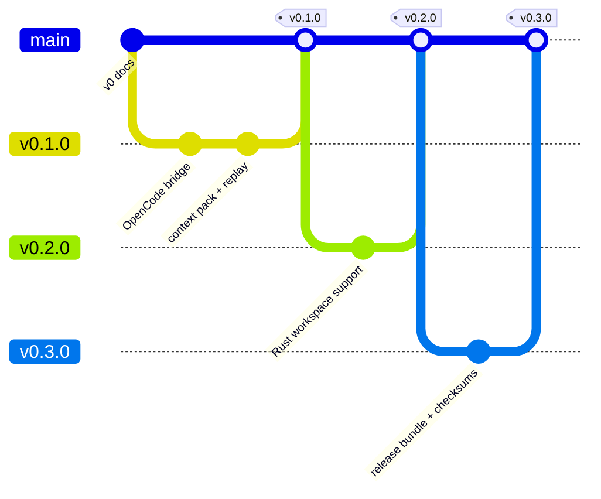

<div align="center">

# 🧩 comptext-mcp

### The deterministic **MCP contract layer** for exposing local `ctxt --json` results to MCP clients.

> **Models are providers. Context is the product.**

<br/>

[](LICENSE)
[](pyproject.toml)
[](https://modelcontextprotocol.io)
[](docs/ROADMAP.md)

[](https://github.com/ProfRandom92/comptext-mcp/actions/workflows/ci.yml)
[](https://docs.astral.sh/ruff/)
[](https://docs.pydantic.dev/)
[](SECURITY.md)
[](#-cryptographic-determinism)
[](#-cryptographic-determinism)
[](ROADMAP.md)

</div>

---

> [!IMPORTANT]
> **Phase 0 is documentation-only.** This repository baseline does **not** implement a
> released MCP server, package runtime, provider integration, token passthrough, proposal
> application, network access, external-agent invocation, or general shell access.
> Pre-existing runtime and package files may be present, but they are **outside Phase 0
> scope** and are **not** treated as release-ready behavior by this documentation baseline.

---

## 📚 Table of Contents

- [Why comptext-mcp?](#-why-comptext-mcp)
- [Architecture at a Glance](#-architecture-at-a-glance)
- [Request Lifecycle](#-request-lifecycle-sequence)
- [Phase State Machine](#-phase-state-machine)
- [Cryptographic Determinism](#-cryptographic-determinism)
- [Tool ↔ Command Mapping Matrix](#-tool--command-mapping-matrix)
- [Capability Matrix](#-capability-matrix)
- [Trusted Command Surface](#-trusted-command-surface)
- [Security Boundaries](#-security-boundaries)
- [Configuration Matrix](#-configuration-matrix)
- [Repository Map](#-repository-map)
- [Roadmap](#-roadmap)
- [Quick Start (future adapter)](#-quick-start-future-adapter)
- [Contributing](#-contributing)
- [License](#-license)

---

## 🎯 Why comptext-mcp?

`comptext-mcp` is the **planned adapter** that lets MCP-aware agents (e.g. OpenCode) read
**deterministic, hash-verified context** produced by the CompText Rust CLI (`ctxt`) — without
ever letting the model invent facts, touch secrets, or run arbitrary shells.



**Design pillars**

| Pillar | What it means |
| :-- | :-- |
| 🧱 **`ctxt` is truth** | `ctxt` owns behavior, schemas, validation, and deterministic context. |
| 🔌 **Adapter, not author** | `comptext-mcp` must **not** invent behavior or synthesize new facts. |
| 🎯 **One-to-one mapping** | Every future MCP tool maps to exactly one stable `ctxt --json` command. |
| 🔒 **Closed allowlist** | Only documented commands are reachable. No general shell access. |
| 🧾 **Untrusted evidence** | Runtime & proposal artifacts are evidence — never workspace truth. |

---

## 🏛 Architecture at a Glance



The adapter is a **thin, auditable bridge**. It never reinterprets `ctxt` output, never
summarizes results into new facts, and never reaches outside the allowlist.

---

## 🔁 Request Lifecycle (Sequence)



---

## 🔀 Phase State Machine



---

## 🔐 Cryptographic Determinism

CompText context packs and replay digests are **content-addressed** with **SHA-256**. The
same workspace bytes always produce the same per-file digest and the same `manifest_sha256`,
giving you a tamper-evident, reproducible fingerprint of exactly what an agent saw.



**Per-file digest**

$$\text{digest}_i = \mathrm{SHA\text{-}256}\big(\,\text{bytes}(file_i)\,\big)$$

**Manifest commitment** — over the canonical, sorted, compact JSON of every record:

$$\text{manifest\_sha256} = \mathrm{SHA\text{-}256}\Big(\;\mathrm{JSON}_{\text{sorted,compact}}\big(\{(path_i,\;bytes_i,\;digest_i)\}\big)\;\Big)$$

| Property | Guarantee |
| :-- | :-- |
| **Reproducibility** | Identical bytes → identical `manifest_sha256` across machines & runs. |
| **Tamper-evidence** | Any change to any file flips its digest and the manifest commitment. |
| **Stable ordering** | Files are sorted by relative POSIX path before hashing. |
| **Normalization** | `CRLF`/`CR` → `LF` for stable text payloads. |
| **Secret hygiene** | Secret-like paths are excluded *before* hashing (never enter the pack). |

> [!NOTE]
> SHA-256 here provides **integrity & reproducibility**, not confidentiality. It is a content
> fingerprint, not encryption.

---

## 🧮 Tool ↔ Command Mapping Matrix

Future MCP tools map **one-to-one** to a closed allowlist of stable local commands:

| 🧩 Future MCP tool | ⚙️ Underlying local command |
| :-- | :-- |
| `ctxt_self_report` | `ctxt --json self report` |
| `ctxt_schema` | `ctxt --json schema` |
| `ctxt_capabilities` | `ctxt --json capabilities` |
| `ctxt_proposals_list` | `ctxt --json proposals list` |
| `ctxt_proposals_inspect_latest` | `ctxt --json proposals inspect latest --max-bytes 12000` |
| `ctxt_proposals_inspect_latest_by_id` | `ctxt --json proposals inspect --id latest --max-bytes 12000` |
| `ctxt_proposals_validate_latest` | `ctxt --json proposals validate latest` |
| `ctxt_proposals_validate_latest_by_id` | `ctxt --json proposals validate --id latest` |
| `ctxt_validate_run` | `ctxt --json validate --run` |
| `ctxt_agent_discover` | `ctxt --json agent discover` |
| `ctxt_runs_list` | `ctxt --json runs list` |
| `ctxt_runs_read_latest` | `ctxt --json runs read latest --max-bytes 12000` |

**Mapping rules**

- Each MCP tool maps to **exactly one** local command.
- The future adapter uses a **closed allowlist**.
- Bounded reads keep `--max-bytes 12000`.
- Errors are **structured local command failures**, not model judgments.



---

## ✅ Capability Matrix

| Capability | Phase 0 status |
| :-- | :--: |
| Documentation & contract baseline | ✅ In scope |
| Closed-allowlist tool **design** | ✅ In scope |
| Released MCP server runtime | ❌ Out of scope |
| Provider integration | ❌ Out of scope |
| Token passthrough | ❌ Out of scope |
| Network access | ❌ Out of scope |
| Proposal application | ❌ Out of scope |
| External-agent invocation | ❌ Out of scope |
| General shell access | ❌ Out of scope |
| Dependency installation by the baseline | ❌ Out of scope |
| Generated reports / artifacts | ❌ Out of scope |

---

## 📜 Trusted Command Surface

Future MCP tools may **only** wrap these stable local commands:

```text
ctxt --json self report
ctxt --json schema
ctxt --json capabilities
ctxt --json proposals list
ctxt --json proposals inspect latest --max-bytes 12000
ctxt --json proposals inspect --id latest --max-bytes 12000
ctxt --json proposals validate latest
ctxt --json proposals validate --id latest
ctxt --json validate --run
ctxt --json agent discover
ctxt --json runs list
ctxt --json runs read latest --max-bytes 12000
```

Unsupported `ctxt` commands are **not** part of the Phase 0 MCP contract.

---

## 🛡 Security Boundaries



- `ctxt` owns behavior, schemas, validation, and deterministic context.
- Local MCP servers and tool bridges are **security boundaries**, not general shell access.
- Runtime & proposal artifacts are **untrusted evidence**, not workspace truth.
- See [`SECURITY.md`](SECURITY.md) for the full policy and reporting process.

---

## ⚙️ Configuration Matrix

Environment variables that the future adapter is designed to honor:

| Variable | Default | Purpose |
| :-- | :-- | :-- |
| `CTXT_WORKDIR` | current dir | Target workspace to analyze (the Rust project, **not** this repo). |
| `CTXT_BIN` | `ctxt` | Path to the CompText Rust CLI (or rely on `PATH`). |
| `CTXT_MCP_READ_ONLY` | `1` | `1` = read-only (recommended). `0` enables write-capable mode. |
| `CTXT_TIMEOUT_SECS` | `30` | Per-command timeout, clamped to `1..=300`. |

Example OpenCode stdio config lives in
[`examples/opencode.windows.json`](examples/opencode.windows.json) and
[`examples/opencode.unix.json`](examples/opencode.unix.json).

---

## 🗂 Repository Map

```text
comptext-mcp/
├── 📄 README.md            ← you are here
├── 📄 PROJEKT.md           ← Phase 0 autonomy contract
├── 📄 SECURITY.md          ← security boundaries & reporting
├── 📄 ROADMAP.md           ← product roadmap
├── 📄 CONTRIBUTING.md      ← contributor guide
├── 📁 docs/
│   ├── ARCHITECTURE.md     ← adapter role & trust boundaries
│   ├── CONTRACTS.md        ← future MCP mapping contract
│   ├── ROADMAP.md          ← phased roadmap
│   └── OPEN_CODE_SETUP.md  ← OpenCode connection guide
├── 📁 examples/            ← OpenCode stdio config samples
├── 📁 scripts/             ← wheel build / install helpers
├── 📁 src/comptext_mcp/    ← runtime files (⚠ outside Phase 0 scope)
└── 📁 tests/               ← import & policy smoke tests
```



---

## 🗺 Roadmap



Product milestones (see [`ROADMAP.md`](ROADMAP.md)):



**Every roadmap item must preserve:** no local LLM requirement · no model downloads ·
read-only default · deterministic output where practical · clear audit trail.

---

## 🚀 Quick Start (future adapter)

> [!WARNING]
> The steps below describe the **intended** future adapter workflow. Phase 0 does not ship a
> released runtime — treat this as design documentation. See [`docs/OPEN_CODE_SETUP.md`](docs/OPEN_CODE_SETUP.md).

**1. Install (from repo root)**

```bash
python3 -m venv .venv
.venv/bin/python -m pip install --upgrade pip
.venv/bin/pip install .
```

```powershell
python -m venv .venv
.\.venv\Scripts\python.exe -m pip install --upgrade pip
.\.venv\Scripts\pip.exe install .
```

**2. Point at `ctxt` and your workspace**

```json
{
  "CTXT_WORKDIR": "C:/path/to/your/rust-project",
  "CTXT_BIN": "C:/path/to/ctxt.exe",
  "CTXT_MCP_READ_ONLY": "1",
  "CTXT_TIMEOUT_SECS": "30"
}
```

**3. Verify in OpenCode** — the server is designed to expose deterministic, read-only tools
that bridge to `ctxt`. See the setup guide for troubleshooting.

---

## 🤝 Contributing

Contributions are welcome — please keep the bridge **small, inspectable, and deterministic**.

- Default mode stays **read-only**.
- **No** local LLM dependency, model downloads, secrets in packs, or arbitrary shell execution.
- Every external command must have a **timeout**.
- Prefer one focused tool over one large multi-mode tool.

Read [`CONTRIBUTING.md`](CONTRIBUTING.md) and the [`CODE_OF_CONDUCT.md`](CODE_OF_CONDUCT.md)
before opening a PR.

---

## 📄 License

Distributed under the **MIT License**. See [`LICENSE`](LICENSE).

<div align="center">
<br/>

**`ctxt` is the deterministic source of truth — `comptext-mcp` is the bridge.**

<sub>Models are providers. Context is the product.</sub>

</div>
